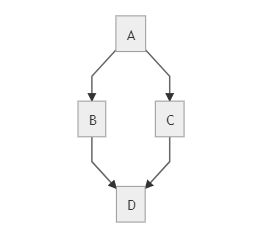

# Introduction
Welcome to Fluxtion service starter, hope you enjoy exploring :)

Service starter manages the deterministic execution of start and stop tasks for a directed acyclic graph of interdependent services. 
Tasks are triggered on a service when all its dependencies have successfully executed their tasks. Either an individual
services or all services can be started or stopped interactively. 

The topological order of managed services is calculated by the service starter to determine the execution order of tasks.

## The problem service starter solves
In many systems services execute independently but need to co-ordinate their lifecycle with each other. A service
may require all downstream services to be started before starting and becoming available to accept upstream requests. If
this order is not respected then unpredictable behaviour can occur, possibly resulting in application errors. 

Similarly, if a downstream service becomes unavailable all upstream services will need to be notified and take appropriate
actions, gracefully shutting down services starting with external facing services and working back towards the failed
service.

As systems grow a complex graph of interdependent services quickly arises. The difficulty in correctly managing
lifecycle overwhelms a handwritten manual solution and can result in brittle non-deterministic behaviour that services 
may rely upon. 

Service starter is a utility that manages the lifecycle of independent services, executing start and stop tasks 
associated with a particular service at the correct time.

### Sample graph


For the example above all services are in a stopped state and a request is made to start **A**. When the application is  running 
events flow from **A** to **B** and **C** in parallel, then events are pushed to **D** from both **B** and **C**. 

To start **A** ServiceManager produces the following outputs, and processes state change inputs from the application:

- ServiceManager produces task list with start task for **D**
- **D** completes task and sends a notification **D** has started successfully to the ServiceManager
- ServiceManager produces task list with **B** and **C** start tasks
- **B** completes task and sends a notification **B** has started successfully to the ServiceManager
- Service manager does nothing, as **C** has not started
- **C** completes task and sends a notification **C** has started successfully to the ServiceManager
- ServiceManager produces task list with start task for **A**
- **A** completes task and sends a notification **A** has started successfully to the ServiceManager
- ServiceManager produces no task list as there are no dependents on **A** to start


# Service starter components
There are three main components within service starter that user code integrates with.
- **[Service](https://github.com/gregv12/fluxtion-service-starter/blob/master/src/main/java/com/fluxtion/example/servicestater/Service.java#L20)** - 
  An external service is described with a Service definition and registered with a ServiceManager. There should be one 
to one mapping between an external service and a definition. The Service description comprises:
    - **name** - a unique service name that can be identified globally
    - **start task** - an optional task that is executed when the service enters the STARTING lifecycle phase
    - **stop task** - an optional task that is executed when the service enters the STOPPING lifecycle phase
    - **requirements** - An optional set of upstream services that must be started for this service to be valid 
    - **dependents** - An optional set of downstream services that require this service to be started in order to be valid
- **[ServiceManager](//github.com/gregv12/fluxtion-service-starter/blob/master/src/main/java/com/fluxtion/example/servicestater/ServiceManager.java)**
  manages the execution of lifecycle tasks associated with a service in a deterministic manner, supports the following behaviour:
    - Interactive start/stop an individual service, triggering tasks on linked services in a deterministic order
    - Interactive start/stop of all registered services, triggering tasks on services in a deterministic order
    - Process service status updates delivered by client application and generate appropriate task list to execute 
    - Registration of a task executor strategy
    - Registration of status listener for logging or visualisation
- **[TaskExecutor](https://github.com/gregv12/fluxtion-service-starter/blob/master/src/main/java/com/fluxtion/example/servicestater/TaskWrapper.java#L37)** 
  Consumes start/stop task lists generated by the ServiceManager and optionally executes the tasks. A default implementation
  is configured [SynchronousTaskExecutor](https://github.com/gregv12/fluxtion-service-starter/blob/master/src/main/java/com/fluxtion/example/servicestater/helpers/SynchronousTaskExecutor.java)
  within the ServiceManager and executes tasks on the callers thread. An [AsynchronousTaskExecutor](https://github.com/gregv12/fluxtion-service-starter/blob/master/src/main/java/com/fluxtion/example/servicestater/helpers/ASynchronousTaskExecutor.java)
  is available as an alternate execution strategy. The set of tasks generated are independent and can safely be executed in
  parallel.

# Integrating into client code
There are two phases to consider when integrating the service starter into client applications, building and execution.

## Building
Users model individual services and create a set of all services to be controlled. The set of services is passed to the static builder methods in 
[ServiceManager](//github.com/gregv12/fluxtion-service-starter/blob/master/src/main/java/com/fluxtion/example/servicestater/ServiceManager.java)
  and an instance of a ServiceManager is returned for the user code to integrate with. 

The dependency graph of services is calculated within the builder method.

### Programming example, building a ServiceManager

```java
//two tasks that are auto triggered to run in parallel
//The first task will trigger a dependent service to start
//The second parallel task is slow the system will not process the dependent start until both parallel tasks have completed
Service inputService = Service.builder("inputService")
        .startTask(TaskExecutionTest::releaseTest)
        .build();
Service parallel_2 = Service.builder("parallel_2")
        .startTask(TaskExecutionTest::parallel_2_sleep_3_seconds)
        .servicesThatRequireMe(List.of(inputService))
        .build();
Service parallel_1 = Service.builder("parallel_1")
        .startTask(TaskExecutionTest::parallel_1_immediate)
        .servicesThatRequireMe(List.of(inputService))
        .build();
Service rootService = Service.builder("rootService")
        .startTask(TaskExecutionTest::triggerBothParallels)
        .servicesThatRequireMe(List.of(parallel_1, parallel_2))
        .build();
server = ServiceManager.interpretedServiceManager(rootService, parallel_1, parallel_2, inputService);
```

## Execution
The ServiceManager is an event driven controller. Services are expected to change state in an unpredictable fashion, the 
ServiceManager reacts to state events delivered by the client application. As the status of each service changes the underlying model
recalculates the tasks that can now be executed and published as a list to the
registered [TaskExecutor](https://github.com/gregv12/fluxtion-service-starter/blob/master/src/main/java/com/fluxtion/example/servicestater/TaskWrapper.java#L37).

Services can be stopped or started interactively, for example by an admin gui. This will result in the publication of a 
task list for execution.

### Programming example, interacting with services

```java
//start the inputService - will cause all the sub-tasks to be running before starting
server.startService("inputService");


//some time later, notify ServiceManager that parallel_2 has started
server.serviceStarted("parallel_2");
```

# Monitoring
Monitoring the state of the model can be a useful source of information for visualisation tools. Service manager provides
two types of monitoring:
- **Status callback:** user code registers a status listener that receives callbacks whenever the state of service changes. 
The callbacks are delivered as a list of 
[ServiceStatusRecord](//github.com/gregv12/fluxtion-service-starter/blob/master/src/main/java/com/fluxtion/example/servicestater/ServiceStatusRecord.java)'s
- **Audit log:** a detailed log delivered as a set of yaml documents, sample:

```yaml
    eventTime: 1640551548618
    logTime: 1640551548618
    groupingId: null
    event: RequestStartAll
    eventToString: {GraphEvent.RequestStartAll()}
    nodeLogs: 
        - handlerA_start: { method: startAllServices, initialStatus: STATUS_UNKNOWN, setStatus: WAITING_FOR_PARENTS_TO_START, markStarting: true}
        - handlerB_start: { method: startAllServices, initialStatus: STATUS_UNKNOWN, setStatus: WAITING_FOR_PARENTS_TO_START, markStarting: true}
        - aggAB_start: { method: startAllServices, markStarting: false}
        - aggAB_start: { method: recalculateStatusForStart}
        - handlerC_start: { method: startAllServices, initialStatus: STATUS_UNKNOWN, setStatus: WAITING_FOR_PARENTS_TO_START, markStarting: true}
        - calcC_start: { method: startAllServices, initialStatus: STATUS_UNKNOWN, setStatus: WAITING_FOR_PARENTS_TO_START, markStarting: true}
        - calcC_start: { method: recalculateStatusForStart, initialStatus: WAITING_FOR_PARENTS_TO_START, setStatus: WAITING_FOR_PARENTS_TO_START}
        - persister_start: { method: startAllServices, markStarting: false}
        - persister_start: { method: recalculateStatusForStart}
        - serviceStatusCache: { method: publishStatus}
        - commandPublisher: { method: publishCommands}
    endTime: 1640551548618
---
    eventTime: 1640551548618
    logTime: 1640551548618
    groupingId: null
    event: PublishStartTask
    eventToString: {GraphEvent.PublishStartTask()}
    nodeLogs: 
        - persister_stop: { method: publishStartTasks}
        - aggAB_stop: { method: publishStartTasks}
        - calcC_stop: { method: publishStartTasks, initialStatus: WAITING_FOR_PARENTS_TO_START, setStatus: STARTING}
        - handlerA_stop: { method: publishStartTasks, initialStatus: WAITING_FOR_PARENTS_TO_START, setStatus: STARTING}
        - handlerB_stop: { method: publishStartTasks, initialStatus: WAITING_FOR_PARENTS_TO_START, setStatus: STARTING}
        - handlerC_stop: { method: publishStartTasks}
        - commandPublisher: { method: publishCommands}
    endTime: 1640551548618 
---
    eventTime: 1640551548618
    logTime: 1640551548618
    groupingId: null
    event: PublishStatus
    eventToString: {GraphEvent.PublishStatus()}
    nodeLogs: 
        - serviceStatusCache: { method: publishCurrentStatus}
        - commandPublisher: { method: publishCommands}
    endTime: 1640551548618
---

```


